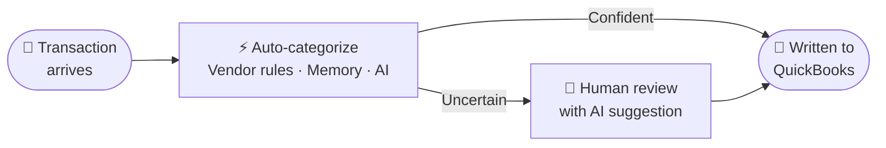
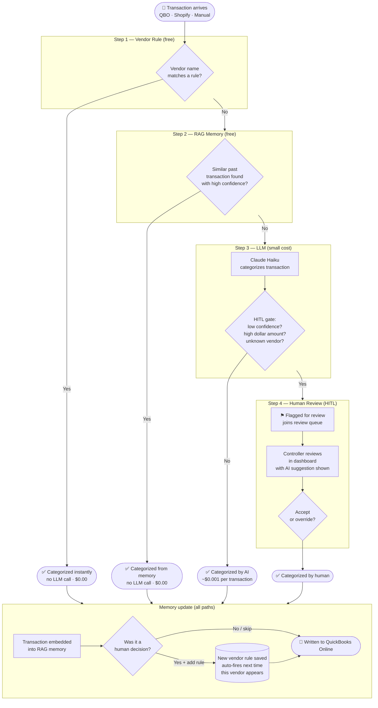

# Accounting Agent — Categorization Pipeline

---

## Simple overview

---

## Detailed pipeline

Every transaction runs through a 4-step pipeline. Each step is tried in order; the first one that produces a confident result wins. The further down the pipeline a transaction goes, the more it costs.

---

---

## What the pipeline costs at scale

| Path | Trigger | LLM cost | Typical share |
|---|---|---|---|
| Vendor rule hit | Exact / prefix / pattern match | $0.00 | ~60% of transactions |
| RAG memory hit | Semantically similar past transaction | $0.00 | ~20% |
| LLM — auto-accepted | AI confident, below HITL threshold | ~$0.001 | ~15% |
| Human review | Low confidence · high amount · unknown vendor | Controller's time | ~5% |

Over time the vendor rule and RAG layers grow, so the LLM and HITL rates shrink — the system gets cheaper and faster the longer it runs.

---

## The three moments that tell the story

**Moment 1 — Instant rule hit**
A Klaviyo charge arrives. The vendor rule fires in milliseconds. No LLM call is made. Zero cost.

**Moment 2 — Ambiguous vendor flagged**
"Luminary Creative Group" has never been seen. RAG finds no confident match. The LLM categorizes it as Advertising (67% confidence). Because the amount is $1,250 and confidence is below the threshold, the HITL gate fires and it lands in the review queue — with the AI's reasoning and top similar past transactions shown to the controller.

**Moment 3 — Human resolves, rule created**
The controller accepts the suggestion and ticks "create vendor rule." The transaction is booked. Next time Luminary Creative Group appears, it hits Step 1 and never reaches the LLM again.
